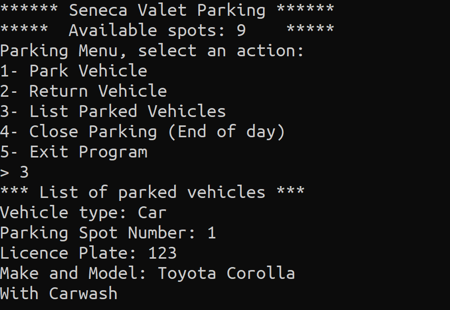
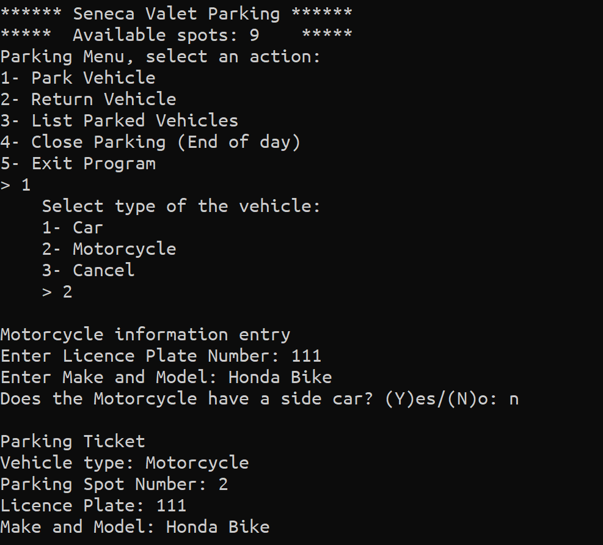

# Parking Application

Final project of C++ course.

## Objectives

- Learning dynamic memory allocation in C++.
- Finding and correcting memory leaks.
- Reading and writing data to csv file.

## Setup & Usage

- Clone the repo.
- Navigate to the folder.
- Open PowerShell in this folder and run `g++ .\Car.cpp .\Menu.cpp .\Motorcycle.cpp .\Parking.cpp .\ParkingAppTester.cpp .\ReadWritable.cpp .\Utils.cpp .\Vehicle.cpp -o app.exe`. This will make an executable file called `app.exe`.
- Run the command `.\app.exe` in PowerShell or simply double click the exe file.

## Screenshots of App

### Returning List of Vehicles

### Adding a vehicle

