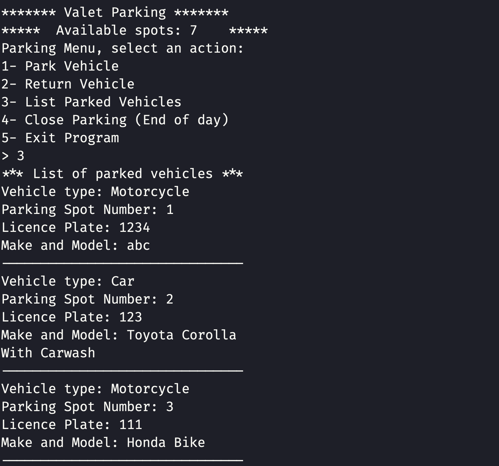
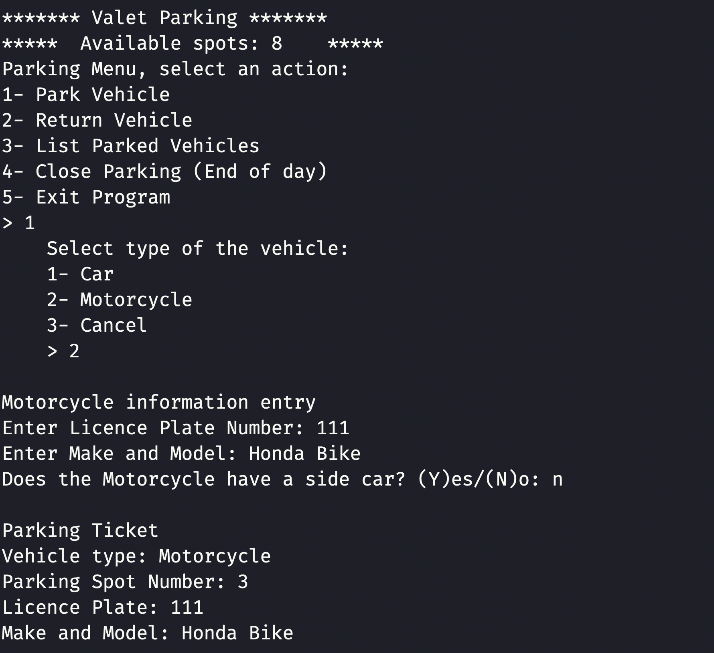

# Parking Application

Final project of C++ course. This app is used to record information about the incoming and outgoing vehicles (cars and motorcycles).

## Objectives

- Learning dynamic memory allocation in C++.
- Finding and correcting memory leaks.
- Reading and writing data to csv file.

## Requirements

- Latest gcc compiler.

## Setup & Usage

- Clone the repo.
- Navigate to the folder.
- Open a terminal window (e.g. PowerShell, macOS Terminal) and enter `make`. This will create an executable file called `app`.
- Type `./app` and hit enter to run the program.

## Screenshots

### Returning List of Vehicles

### Adding a vehicle

